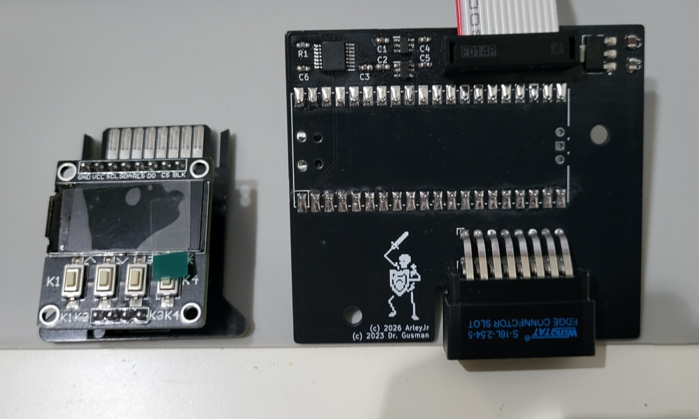
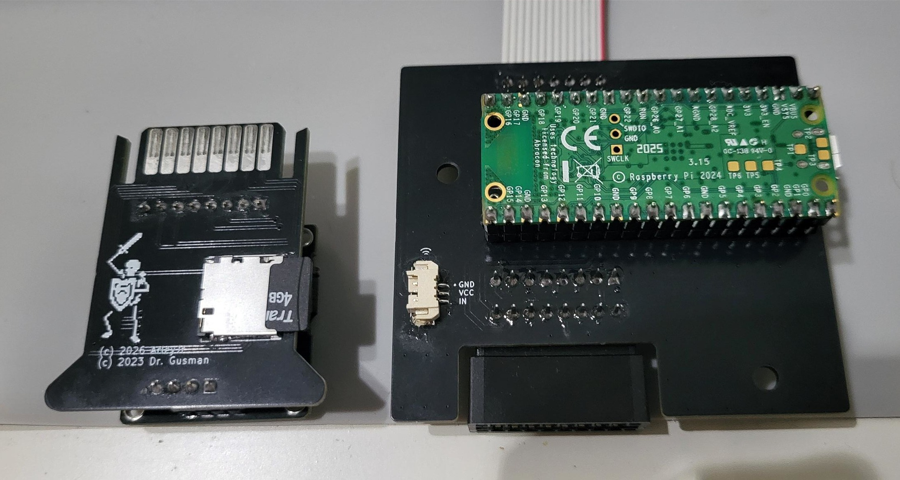

# MicroPicoDrive NG — Hardware

KiCad hardware design for an internal Microdrive replacement for the Sinclair QL. The device emulates a Microdrive cartridge drive using a Raspberry Pi Pico (RP2040) and stores data on a microSD card, fitting in the QL's internal Microdrive bay.

This is an evolution of [gusmanb/micropicodrive](https://github.com/gusmanb/micropicodrive) by Agustín Gimenez Bernad, who reverse-engineered the Microdrive protocol and created the original design. All credit for the core concept and the main board design goes to him.

This repository contains only the hardware. The firmware lives in a separate repository: [micropicodrive-ng-firmware](https://github.com/arleybls/micropicodrive-ng-firmware).

## What changed in this version

The cartridge board was redesigned around a different user-interface module:

- The I²C SSD1306 OLED was replaced with a 0.96" 80×160 IPS colour display (ST7735S, 4-wire SPI) with four integrated pushbuttons (K1–K4).
- A fourth button and a blinking activity LED were added; the three separate status LEDs were removed.
- The display reset uses a passive RC circuit on the cartridge and the backlight is tied to +3.3V, so the 16-pin edge connector still carries everything with no pins to spare.

The main board is essentially the original MicroPicoDrive design, updated to KiCad 10 format with the edge-connector pinout changes required by the new cartridge.

## Boards

| Board | Folder | Description |
|---|---|---|
| MicroPicoDrive | [MicroPicoDrive/](MicroPicoDrive/) | Main controller board: Raspberry Pi Pico, 5V regulation, level shifters (SN74LVC1T45 ×2, TXU0304), QL Microdrive bus header, edge connector to the cartridge |
| MicroPicoDriveCartridge | [MicroPicoDriveCartridge/](MicroPicoDriveCartridge/) | Cartridge board: microSD socket, ST7735S SPI display with 4 buttons, activity LED, 16-pin edge connector |

Both projects are in KiCad 10 format. Custom symbol and footprint libraries are included alongside each project and referenced with relative paths, so the projects open without extra library setup.

## Assembled boards

Cartridge (left) and main board (right), front side — the cartridge's ST7735S display with the K1–K4 buttons, and the main board's level shifters, cartridge edge-connector slot, and ribbon cable to the QL:

Back side — the cartridge's microSD socket, and the main board with the Raspberry Pi Pico mounted and the motor connector:

## Fabrication

Gerber and drill files are included for both boards:

- Main board: [MicroPicoDrive/gerbers/](MicroPicoDrive/gerbers/)
- Cartridge: [MicroPicoDriveCartridge/gerbers/](MicroPicoDriveCartridge/gerbers/)

## Bill of materials

Interactive HTML BOMs are provided per board:

- Main board: [MicroPicoDrive/bom/ibom.html](MicroPicoDrive/bom/ibom.html)
- Cartridge: [MicroPicoDriveCartridge/bom/ibom.html](MicroPicoDriveCartridge/bom/ibom.html)

## Credits

- Original MicroPicoDrive hardware, firmware, and Microdrive protocol reverse engineering: [Agustín Gimenez Bernad (gusmanb)](https://github.com/gusmanb)
- SPI display / 4-button cartridge redesign: Arley Silveira

## License

MIT — see [LICENSE](LICENSE). The license retains the original author's copyright notice alongside the notice for the modifications in this repository.

## Related repositories

- [micropicodrive-ng-firmware](https://github.com/arleybls/micropicodrive-ng-firmware) — the firmware that brings these boards to life. It runs on the Pico mounted on the main board and answers the QL's Microdrive bus in real time, serving cartridge images from the microSD card with a menu-driven UI on the cartridge's colour display. Two builds are available: Lite for the standard Pico (RP2040) and Full for the Pico 2 W (RP2350) with Bluetooth and wireless firmware updates. Flash it to the assembled hardware and the QL sees a real Microdrive.
- [sinclair-mdv-builder](https://github.com/arleybls/sinclair-mdv-builder) — a Windows desktop tool (.NET 8 / WPF) to create, inspect, edit, and extract Sinclair QL Microdrive images (`.MDV`). Use it to author or modify cartridge images on your PC — importing files or ZIP archives while preserving QL file metadata — then copy them to the microSD card for this drive to serve to the QL.
