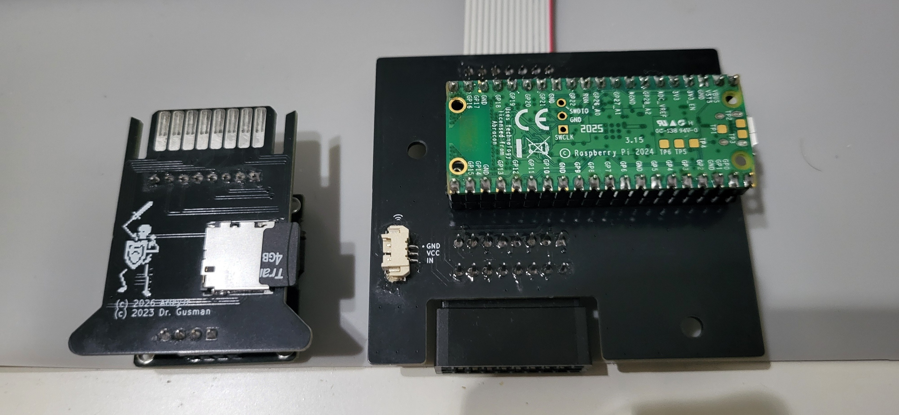
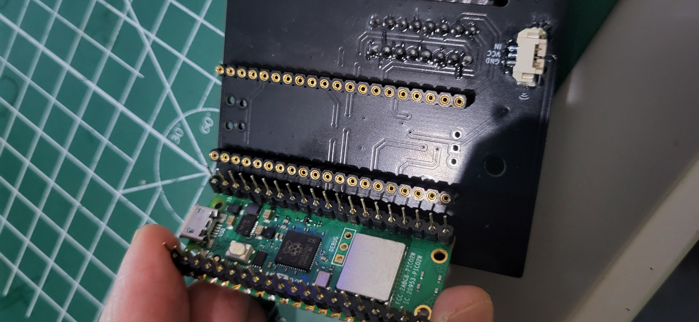
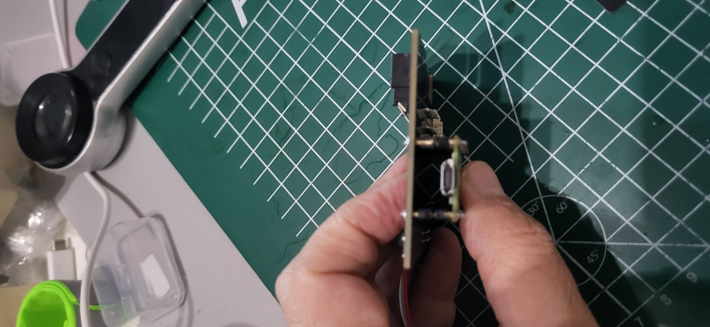
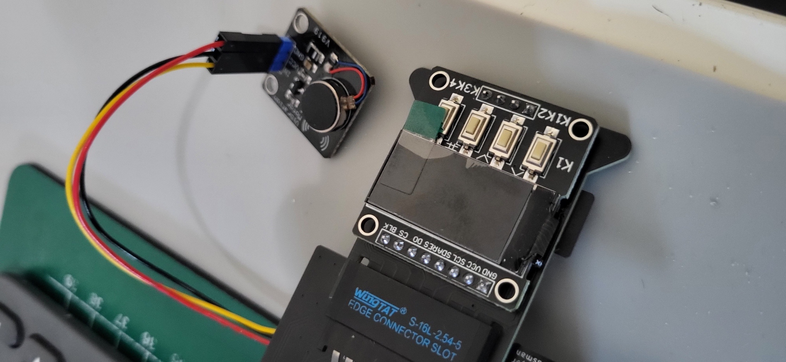

# MicroPicoDrive NG hardware installation manual

This manual covers fitting the MicroPicoDrive NG mainboard inside a Sinclair
QL, including the Pico and the optional vibration motor. Day-to-day use, SD
card preparation, System Tools and firmware updates are covered by the
firmware manual in the
[firmware repository](https://github.com/arleybls/micropicodrive-ng-firmware).

**How complete is this guide?** The operating steps have been checked against
the firmware, and the photographs show the current NG boards, the Pico
orientation and the optional motor module. What we could not yet confirm is
the QL ribbon orientation, the mounting hardware and the exact fitting steps
for each drive bay — so treat this guide as an outline, and follow the
instructions supplied with your board revision for those details.

## The two parts and firmware versions

The **mainboard** stays inside the QL and connects to its Microdrive bus. It
carries the Raspberry Pi Pico that runs the firmware. The removable
**cartridge board** carries the display, four buttons and microSD socket.
It plugs into the mainboard's edge connector.

A **cartridge image** is a file on the microSD card that behaves like one QL
Microdrive cartridge. When you *mount* an image, the QL sees it as a cartridge
sitting in the drive; when you *eject* it, you are back in the file browser.
Mounting and ejecting happen on the screen — they are not the same thing as
physically plugging in or pulling out the cartridge board.

| Feature | Lite: Raspberry Pi Pico / RP2040 | Full: Raspberry Pi Pico 2 W / RP2350 |
|---|---|---|
| Image browsing, QL loading and saving | Yes | Yes |
| Display and motor settings | Yes | Yes |
| SD card firmware updates | UF2 file | BIN file and matching JSON manifest |
| Bluetooth file management and updates | No | Yes |
| Revert Firmware | No | When another firmware slot is available |
| BOOTSEL Mode menu entry | Yes | No |

Install the firmware that matches the Pico you actually fitted. The Pico 2 W's
wireless features use Bluetooth Low Energy (BLE), not Wi-Fi.

## Installing the mainboard in the QL

### Before opening the case

**What you'll need before you open the case:**

- The assembled mainboard and cartridge board
- The correct QL ribbon cable and mounting hardware for your kit
- A prepared microSD card

If your Pico came blank, plan to install the firmware before you close the QL
up again — see the **Firmware updates** section of the firmware manual.

1. Shut down the QL, disconnect its power supply and disconnect attached
   equipment. Remove any tape cartridges.
2. Work on a clean surface and handle the boards by their edges. Keep loose
   screws and other metal away from the electronics.
3. Open the QL using the service instructions for its case revision. Lift the
   cover carefully: the keyboard membrane tails connect it to the motherboard.
   Avoid pulling, sharply bending or trapping these tails.
4. Record the existing Microdrive cable routing and connector orientation
   before disconnecting anything.

### Fitting outline

The mainboard replaces an internal Microdrive mechanism. Its QL bus connector
is **J2**, a 14-pin (2 by 7) header. **J1** is the cartridge edge connector.
The optional motor connection is **J3**, the small three-pin socket marked
`GND`, `VCC` and `IN`. Confirm these markings against your actual board revision.

### Fitting the Pico

If the mainboard was supplied without a Pico, fit the correct board before
installing the assembly in the QL. Use a Raspberry Pi Pico for Lite firmware or
a Pico 2 W for Full firmware.

1. Disconnect QL and USB power. Hold the Pico by its edges and avoid touching
   the contacts.
2. Orient it as shown below: the Pico's USB connector sits at the same end as
   the mainboard's J3 motor socket. Check the orientation before engaging any
   pins.
3. Align both rows with the sockets. Start every pin squarely, then press the
   board down evenly with light pressure at both ends. Stop if a pin bends or
   the rows do not enter together.
4. Look along both sides to confirm that no pin is outside a socket and that
   the Pico is fully and evenly seated.

The Pico sits underneath the mainboard. That low profile is what leaves room
for the QL keyboard above it, so don't add tall headers or spacers unless your
enclosure's fitting instructions say you can.

### Installing and connecting the optional motor

Use a **driver-equipped vibration module** made for a logic-level trigger and
a 5 V supply, such as the module shown below. J3 is not a bare-motor output:
connecting a motor directly to it can overload GP11 and damage the Pico.

J3 is a three-pin Molex PicoBlade socket. Its electrical connections are:

| J3 connection | Function |
|---|---|
| GND | Ground |
| VCC | +5 V supply for the motor module |
| IN | Logic input from Pico GP11 |

1. Disconnect QL and power it off before connecting or moving the motor.
2. Inspect the labels at both ends. Connect J3 `GND` to the module's ground,
   J3 `VCC` to its supply input, and J3 `IN` to its trigger input. Use the
   supplied keyed lead where available. **Do not rely on wire colour alone**;
   cable colours and module pin order can differ.
3. Check that the plug is fully seated and that no contact is shifted sideways.
   Keep the lead away from the cartridge opening, keyboard membrane tails,
   sharp edges and screw posts.
4. Before fixing the module permanently, close or support the keyboard safely,
   power the QL and run **System Tools > LED & Motor Test**. The motor should
   run for five seconds. Switch off and disconnect power again before adjusting it.
5. Removing the original Microdrive exposes a support hole in the lower case.
   Place the motor module over that support as shown below and align one of its
   mounting holes with the case support hole. Pass the **supplied screw** through
   the aligned holes, fit the **supplied nut** on the opposite side, and tighten
   until the module is secure. Do not overtighten: the module PCB and plastic
   support can be damaged. Check that the module lies flat and that its solder
   joints cannot touch the QL motherboard or nearby metalwork.
6. Re-run LED & Motor Test after final assembly. Configure normal feedback under
   **System Tools > Motor** as described in the firmware manual. Leave enough
   cable slack for servicing, but keep the lead out of the keyboard, cartridge
   and case-screw paths.

### Fitting the mainboard

1. Identify the drive position to be replaced using the kit's fitting
   instructions. The firmware has no menu setting for choosing `mdv1_` or
   `mdv2_`; numbering depends on the QL's drive-select chain and wiring.
2. Remove the selected mechanism as directed for the kit. Retain its hardware
   separately so it can be restored later.
3. Fit the mainboard with the specified supports and fasteners, with its
   cartridge connector aligned to the case opening. Check that the underside
   cannot touch conductive parts and that inserting a cartridge will not bend
   an unsupported board. Do not assume the original screws are the right length.
4. Connect the QL ribbon to J2 only after confirming pin 1 and the cable
   orientation at **both ends** against the board-specific fitting
   instructions. Check that neither connector is offset by a row or a pin.
   The stripe on the cable is not, by itself, proof of the right orientation.
5. If required, fit the Pico and optional motor as described above. Make these
   connections with power disconnected.
6. Route cables clear of case posts, sharp edges and the cartridge opening.
   Check connector seating, board clearance and the keyboard connections before
   refitting the cover.
7. Insert the prepared cartridge board without force, reconnect the QL and
   perform the first-start check described in the **First start and everyday
   use** section of the firmware manual.

Only the removable cartridge board is designed for powered insertion and
removal. Disconnect QL power before changing the mainboard, Pico, ribbon or
motor wiring. USB servicing also needs a board-specific power arrangement;
do not assume simultaneous USB and QL power is supported.

Hardware drawings, schematics and board photographs live in this repository's
board folders, `MicroPicoDrive/` and `MicroPicoDriveCartridge/`.

### If something goes wrong after reassembly

- **No display:** check cartridge-board seating and QL power. Disconnect power
  before inspecting internal ribbon or Pico connections.
- **QL cannot read the image:** wait for mounting, use the correct `mdv`
  number and try a known-good image; inspect wiring only with power
  disconnected.

See the firmware manual's Troubleshooting section for everything else.
